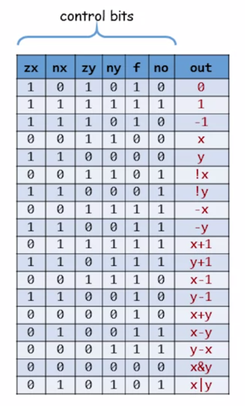

# 实现内容

[官方地址](https://www.nand2tetris.org/project02)

- 半加器：求两个bit的和，输出sum和carry。实际就是一个异或门和一个与门。
- 全加器：考虑进位a,b,c，输出sum和carry。总共使用 2 个与门 2个异或门 1个或门
- 16位加法器

算数逻辑单元（ALU）的实现会相对复杂一些，需要考虑的信息包括：

- 输入：两个运算数
  - z(x/y): 是否将运算数置为0
  - n(x/y): 是否将运算数按位取反
  - f：选择计算方式（+ 或 &）
  - no: 是否将out取反后输出
- 输出
  - 运算结果
  - zr: flags, 结果为0。**对输出各个位按位或（Or16Way），可得是否为全0。**
  - ng: flags, 结果为负数。**取最高位与0或，可检查输出是否为负数**。

输出的 flags 可被用于跳转指令等使用。通过不同的输入选择，ALU可进行的运算如下：

