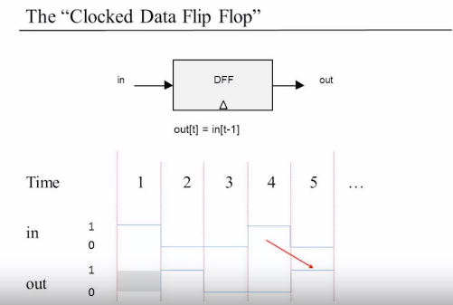

# 内存 RAM

> 在构建了计算机的 ALU 之后，我们开始构建计算机的主内存单元，也称为随机存取存储器或 RAM。 这将逐步完成，从基本触发器门到一位寄存器，再到 n 位寄存器，再到一系列 RAM 芯片。 与基于组合逻辑的计算机处理芯片不同，计算机的存储器逻辑需要基于时钟的时序逻辑。 我们将从这个理论背景的概述开始，然后继续构建我们的内存芯片组。

组合逻辑->时序逻辑
- 组合逻辑：out[t] = f(in[t])
- 时序逻辑：out[t] = f(in[t-1]) -> state[t] = f(state[t-1])
- 时序逻辑需要考虑电平延迟，则需要选择一个恰当的时钟周期

# 实现

- D-触发器（Flip-Flops）：out[t] = in[t-1]
- 寄存器（Register）: 保存1个bit的信息。
- 内存单元（RAM）
- 程序计数器（PC）

1. D-触发器
在这个课程里直接把触发器当成一个元件来使用，而不考虑如何从 NAND 逻辑门去组建。

2. 1-bit 寄存器

用一个数据选择器接在D-触发器前，分别对应输入 in 和 out。load 作为数据选择器的sel信号。

3. 寄存器（16bit）：并联 16个 1-bit 寄存器。

4. RAM8: 8个寄存器大小的内存，每个寄存器为16bit。

并联8个寄存器。address[3] 用数据分配器构成的 3-8 译码器作为8个load使用。

**输出上需要加一个数据选择器来合并各个寄存器的输出。**

5. RAM64

使用8个RAM8组成，使用address[0..2] 选RAM8片内寄存器，address[3..5] 作为 3-8 译码器输入，输出选8个RAM8。

6. PC: 使用三个 MUX16 分配选择输出即可。 注意选择顺序为： inc->load->reset。 