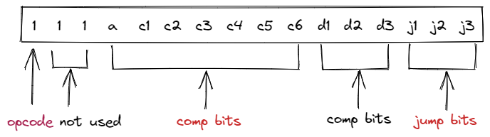

# 引言

构建新计算机系统的一个至关重要的方面是设计低级机器语言或指令集，通过它可以指示计算机执行各种操作。事实证明，这可以在计算机本身实际构建之前完成。例如，我们可以编写一个Java程序来模拟尚未建成的计算机，然后用它来模拟用新机器语言编写的程序的执行。这样的实验可以让我们很好地了解新计算机的基本“外观和感觉”，并导致可能会改变和改进硬件和语言设计的决策。采取类似的方法，在本模块中我们假设已经构建了 Hack 计算机和机器语言，并使用 Hack 机器语言编写一些低级程序。然后，我们将使用提供的 CPU 模拟器来测试和执行我们的程序。
## 概要

1. 内存的层次结构（Memory Hierarchy）

因为访问 memory 是 expensive 的：
- 长地址访问
- 将内存中的数据加载到CPU中很耗时

所以提出了**寄存器 <-> Cache <-> Main Memory <-> Disk** 的层次结构。


2. 寻址模式

- 寄存器寻址(Register)
  - `Add R1, R2     //  R2 + R1 -> R2`
- 直接寻址（Direct）
  - `Add R1, M[200] // R1 + MEM[200] -> MEM[200]`
- 间接寻址(Indirect)
  - `Add R1, @A     // R1 + MEM[A] -> MEM[A]`
- 立即数寻址(Immediate)
  - `Add 73, R1     // R1 + 73 -> R1`


3. 输入输出设备

内存映射IO

4. 控制流（Flow Controls）

CPU 通常按序执行， 但有时需要无条件跳转执行（比如实现循环）、有条件跳转（例如 if else 分支）。

# 机器语言指令


Hack机器语言使用 A D M 三个标识分别指定三个寄存器。A D 都是一个16bit的寄存器，M代表由寄存器A寻址的内存M[A]， 从此处可以看出 A 是 Address 的含义。

Hack机器语言使用 A C 两种指令。

- A 指令：`@val`，设置 A 寄存器值为 val 并且选择使用 M[A] 内存。

```c
// 例如实现 M[100] = -1
@100;   // A = 100
M = -1; // RAM[100] = -1
```

- C 指令：`dest = comp; jump`
  - comp 代表计算方式（对应ALU的所有计算方式，参考[Project2的ALU计算表](../02/README.md) ）
  - dest 代表计算的结果存储的位置（可以为NULL，表示没有结果输出）
  - jump 代表跳转条件（比较条件、无条件跳转），如果计算结果为0，则跳转到 ROM[A] 执行。可进行的操作包括：`NULL, JGT, JEQ, JGE, JLT, JNE, JLE, JMP`

```c
// 将 D 寄存器设为 -1
D = -1 // ALU 可以直接输出 -1 的

// 设置 RAM[300] 为 D-1
@300    // A = 300
M = D-1 

// 如果 D - 1 = 0, 跳转到ROM[56]执行
@56 
D-1; JEQ
```

## **Specification**

如何将上述设计的语言形式转换为机器码（二进制）形式：`Symbolic -> Binary`。

- A 指令：`@val`，设置 A 寄存器值为 val。

共16bit, 最高位为 opcode, 其余15位表示value。

- C 指令：`dest = comp; jump`，如图所示



comp 中 `a c1 c2 c3 c4 c5 c6` 输入给ALU，分别对应了ALU的`!f zx nx zy ny no`。C指令各个 bit 的含义如下：


# 实现

[Project 4: Machine Language Programming](https://www.nand2tetris.org/project04)

## 乘法运算 （mult）

计算 R2 = R0 * R1 ，编写好汇编后打开 _Assembler.bat_ 将汇编代码编译为机器码，保存文件。再打开 _CPU Emulator.bat_ 测试是否正确。

```
  @2
  M = 0  // 初始为0
(LOOP)
  @1
  M = M-1; 
  D = M
  @END    // 循环结束
  D;JLT   //

  @0
  D = M 
  @2               
  M = D + M
  
  @LOOP
  0;JMP
(END)
  @END
  0;JMP   // 死循环
```

## 输入输出（Fill）

伪代码如下，具体实现在 Fill.asm
```
while(1) {
  if(is_key_down()) {
        fill();  // 填充当前像素点
    } else { 
        clear(); // 清除当前像素点
    }
}
```